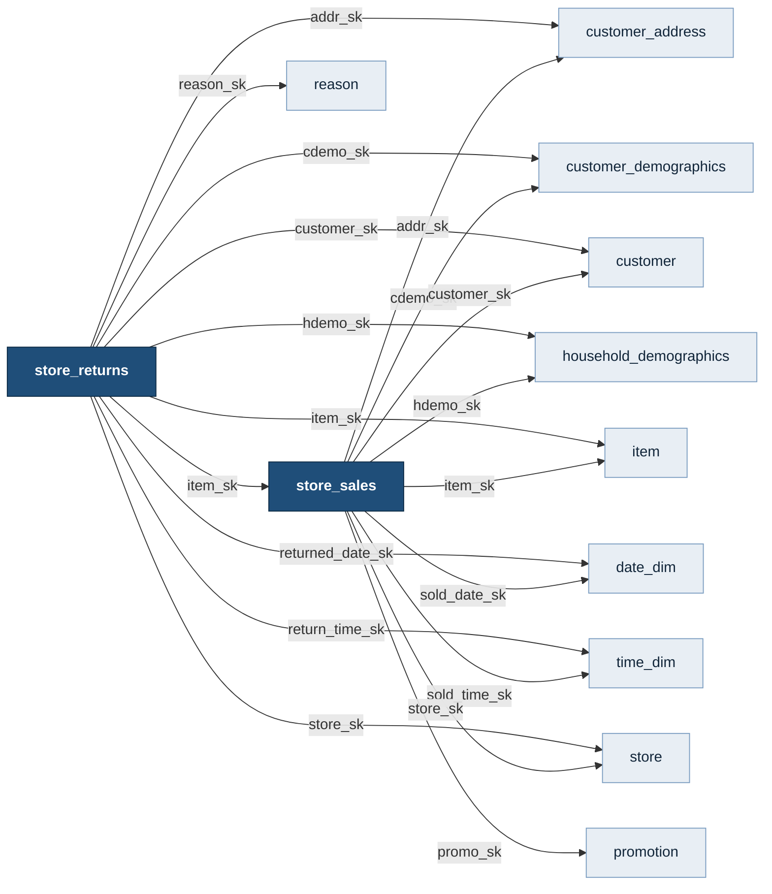
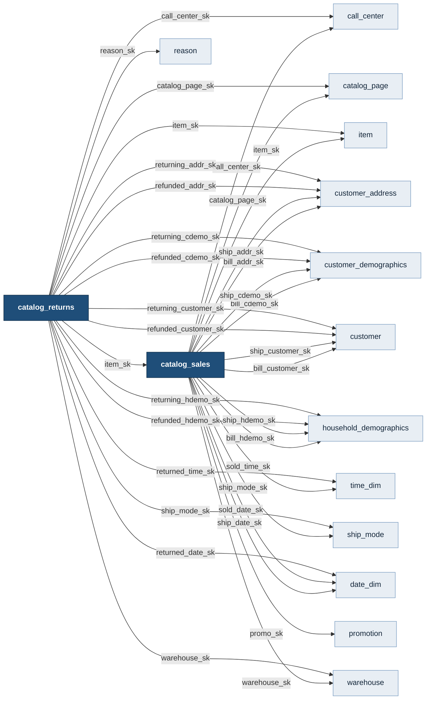
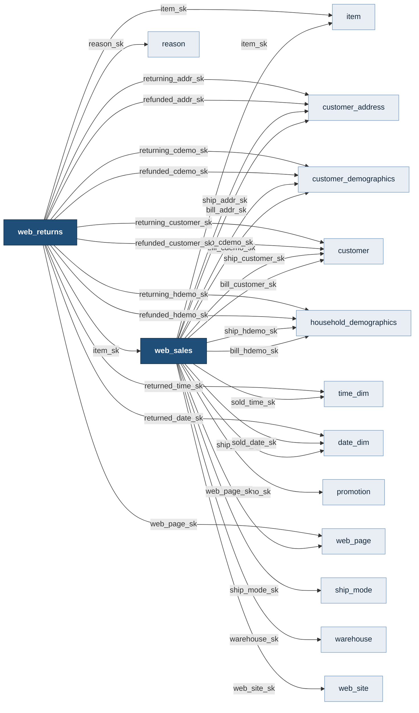
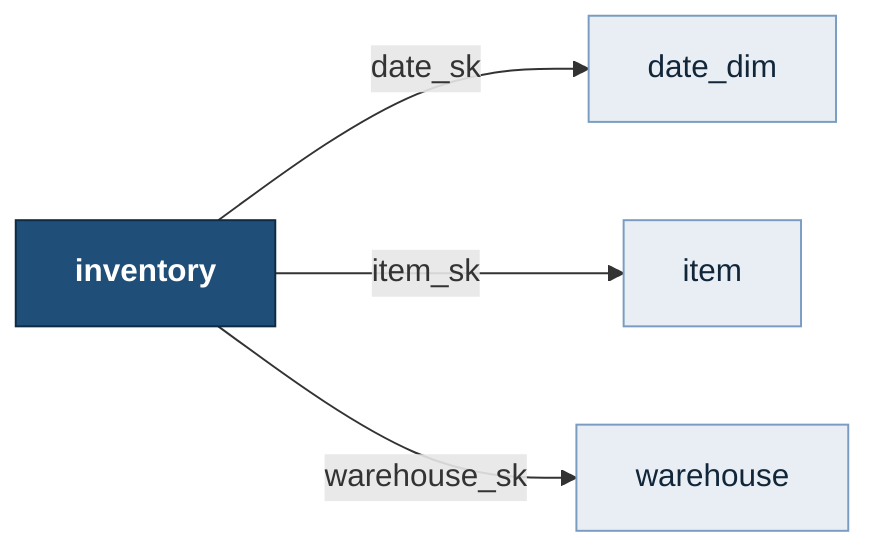
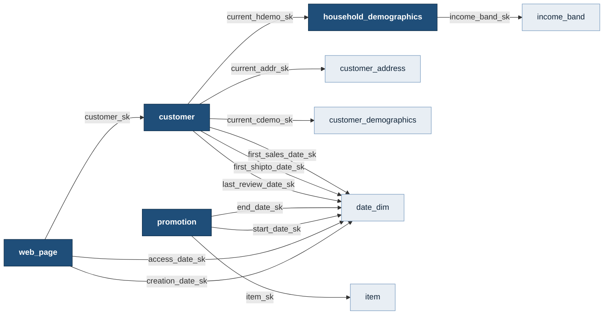

# TPC-DS Schema Relationships

Generated from the 107 foreign keys in `sql/02_foreign_keys.sql`, which are
defined by Clauses 2.3 and 2.4 of the TPC-DS v4.0.0 specification.

Row counts shown are the loaded SF=1 data set.

## The shape

TPC-DS models **one business across three sales channels** — store, catalog, and web.
Each channel has a *sales* fact and a *returns* fact; inventory is a seventh fact
covering the warehouse side. All seven share the same dimension tables.

```
            store channel        catalog channel          web channel
            ------------         ---------------          -----------
  sales     store_sales          catalog_sales            web_sales
                |                      |                      |
  returns   store_returns        catalog_returns          web_returns

  inventory                     inventory  (item x warehouse x date)
```

It is a **snowflake**, not a pure star: `customer` and `household_demographics`
are themselves dimension tables with their own foreign keys.

---

## Degree: how connected is each table

| Table | Kind | Rows (SF=1) | FKs out | Referenced by |
|---|---|---:|---:|---:|
| `store_sales` | fact | 2,880,404 | 9 | 1 |
| `store_returns` | fact | 287,514 | 10 | 0 |
| `catalog_sales` | fact | 1,441,548 | 17 | 1 |
| `catalog_returns` | fact | 144,067 | 17 | 0 |
| `web_sales` | fact | 719,384 | 17 | 1 |
| `web_returns` | fact | 71,763 | 14 | 0 |
| `inventory` | fact | 11,745,000 | 3 | 0 |
| `date_dim` | dimension | 73,049 | 0 | 23 |
| `time_dim` | dimension | 86,400 | 0 | 6 |
| `customer` | dimension | 100,000 | 6 | 11 |
| `customer_address` | dimension | 50,000 | 0 | 11 |
| `customer_demographics` | dimension | 1,920,800 | 0 | 11 |
| `household_demographics` | dimension | 7,200 | 1 | 11 |
| `income_band` | dimension | 20 | 0 | 1 |
| `item` | dimension | 18,000 | 0 | 8 |
| `store` | dimension | 12 | 1 | 2 |
| `call_center` | dimension | 6 | 2 | 2 |
| `catalog_page` | dimension | 11,718 | 2 | 2 |
| `web_site` | dimension | 30 | 2 | 1 |
| `web_page` | dimension | 60 | 3 | 2 |
| `warehouse` | dimension | 5 | 0 | 4 |
| `promotion` | dimension | 300 | 3 | 3 |
| `reason` | dimension | 75 | 0 | 3 |
| `ship_mode` | dimension | 20 | 0 | 3 |

`date_dim` is referenced **23 times** — more than any other table. That is the single
most important fact about this schema for query planning: almost every query joins
to it, and most filter on it.

---

## Fact tables and their dimensions

### `store_sales`  (2,880,404 rows)

| Column | References |
|---|---|
| `ss_addr_sk` | `customer_address` (ca_address_sk) |
| `ss_cdemo_sk` | `customer_demographics` (cd_demo_sk) |
| `ss_customer_sk` | `customer` (c_customer_sk) |
| `ss_hdemo_sk` | `household_demographics` (hd_demo_sk) |
| `ss_item_sk` | `item` (i_item_sk) |
| `ss_promo_sk` | `promotion` (p_promo_sk) |
| `ss_sold_date_sk` | `date_dim` (d_date_sk) |
| `ss_sold_time_sk` | `time_dim` (t_time_sk) |
| `ss_store_sk` | `store` (s_store_sk) |

### `store_returns`  (287,514 rows)

| Column | References |
|---|---|
| `sr_addr_sk` | `customer_address` (ca_address_sk) |
| `sr_cdemo_sk` | `customer_demographics` (cd_demo_sk) |
| `sr_customer_sk` | `customer` (c_customer_sk) |
| `sr_hdemo_sk` | `household_demographics` (hd_demo_sk) |
| `sr_item_sk` | `item` (i_item_sk) |
| `sr_reason_sk` | `reason` (r_reason_sk) |
| `sr_returned_date_sk` | `date_dim` (d_date_sk) |
| `sr_return_time_sk` | `time_dim` (t_time_sk) |
| `sr_store_sk` | `store` (s_store_sk) |
| `sr_item_sk, sr_ticket_number` | `store_sales` (ss_item_sk, ss_ticket_number) |

### `catalog_sales`  (1,441,548 rows)

| Column | References |
|---|---|
| `cs_bill_addr_sk` | `customer_address` (ca_address_sk) |
| `cs_bill_cdemo_sk` | `customer_demographics` (cd_demo_sk) |
| `cs_bill_customer_sk` | `customer` (c_customer_sk) |
| `cs_bill_hdemo_sk` | `household_demographics` (hd_demo_sk) |
| `cs_call_center_sk` | `call_center` (cc_call_center_sk) |
| `cs_catalog_page_sk` | `catalog_page` (cp_catalog_page_sk) |
| `cs_item_sk` | `item` (i_item_sk) |
| `cs_promo_sk` | `promotion` (p_promo_sk) |
| `cs_ship_addr_sk` | `customer_address` (ca_address_sk) |
| `cs_ship_cdemo_sk` | `customer_demographics` (cd_demo_sk) |
| `cs_ship_customer_sk` | `customer` (c_customer_sk) |
| `cs_ship_date_sk` | `date_dim` (d_date_sk) |
| `cs_ship_hdemo_sk` | `household_demographics` (hd_demo_sk) |
| `cs_ship_mode_sk` | `ship_mode` (sm_ship_mode_sk) |
| `cs_sold_date_sk` | `date_dim` (d_date_sk) |
| `cs_sold_time_sk` | `time_dim` (t_time_sk) |
| `cs_warehouse_sk` | `warehouse` (w_warehouse_sk) |

### `catalog_returns`  (144,067 rows)

| Column | References |
|---|---|
| `cr_call_center_sk` | `call_center` (cc_call_center_sk) |
| `cr_catalog_page_sk` | `catalog_page` (cp_catalog_page_sk) |
| `cr_item_sk` | `item` (i_item_sk) |
| `cr_reason_sk` | `reason` (r_reason_sk) |
| `cr_refunded_addr_sk` | `customer_address` (ca_address_sk) |
| `cr_refunded_cdemo_sk` | `customer_demographics` (cd_demo_sk) |
| `cr_refunded_customer_sk` | `customer` (c_customer_sk) |
| `cr_refunded_hdemo_sk` | `household_demographics` (hd_demo_sk) |
| `cr_returned_date_sk` | `date_dim` (d_date_sk) |
| `cr_returned_time_sk` | `time_dim` (t_time_sk) |
| `cr_returning_addr_sk` | `customer_address` (ca_address_sk) |
| `cr_returning_cdemo_sk` | `customer_demographics` (cd_demo_sk) |
| `cr_returning_customer_sk` | `customer` (c_customer_sk) |
| `cr_returning_hdemo_sk` | `household_demographics` (hd_demo_sk) |
| `cr_ship_mode_sk` | `ship_mode` (sm_ship_mode_sk) |
| `cr_warehouse_sk` | `warehouse` (w_warehouse_sk) |
| `cr_item_sk, cr_order_number` | `catalog_sales` (cs_item_sk, cs_order_number) |

### `web_sales`  (719,384 rows)

| Column | References |
|---|---|
| `ws_bill_addr_sk` | `customer_address` (ca_address_sk) |
| `ws_bill_cdemo_sk` | `customer_demographics` (cd_demo_sk) |
| `ws_bill_customer_sk` | `customer` (c_customer_sk) |
| `ws_bill_hdemo_sk` | `household_demographics` (hd_demo_sk) |
| `ws_item_sk` | `item` (i_item_sk) |
| `ws_promo_sk` | `promotion` (p_promo_sk) |
| `ws_ship_addr_sk` | `customer_address` (ca_address_sk) |
| `ws_ship_cdemo_sk` | `customer_demographics` (cd_demo_sk) |
| `ws_ship_customer_sk` | `customer` (c_customer_sk) |
| `ws_ship_date_sk` | `date_dim` (d_date_sk) |
| `ws_ship_hdemo_sk` | `household_demographics` (hd_demo_sk) |
| `ws_ship_mode_sk` | `ship_mode` (sm_ship_mode_sk) |
| `ws_sold_date_sk` | `date_dim` (d_date_sk) |
| `ws_sold_time_sk` | `time_dim` (t_time_sk) |
| `ws_warehouse_sk` | `warehouse` (w_warehouse_sk) |
| `ws_web_page_sk` | `web_page` (wp_web_page_sk) |
| `ws_web_site_sk` | `web_site` (web_site_sk) |

### `web_returns`  (71,763 rows)

| Column | References |
|---|---|
| `wr_item_sk` | `item` (i_item_sk) |
| `wr_reason_sk` | `reason` (r_reason_sk) |
| `wr_refunded_addr_sk` | `customer_address` (ca_address_sk) |
| `wr_refunded_cdemo_sk` | `customer_demographics` (cd_demo_sk) |
| `wr_refunded_customer_sk` | `customer` (c_customer_sk) |
| `wr_refunded_hdemo_sk` | `household_demographics` (hd_demo_sk) |
| `wr_returned_date_sk` | `date_dim` (d_date_sk) |
| `wr_returned_time_sk` | `time_dim` (t_time_sk) |
| `wr_returning_addr_sk` | `customer_address` (ca_address_sk) |
| `wr_returning_cdemo_sk` | `customer_demographics` (cd_demo_sk) |
| `wr_returning_customer_sk` | `customer` (c_customer_sk) |
| `wr_returning_hdemo_sk` | `household_demographics` (hd_demo_sk) |
| `wr_web_page_sk` | `web_page` (wp_web_page_sk) |
| `wr_item_sk, wr_order_number` | `web_sales` (ws_item_sk, ws_order_number) |

### `inventory`  (11,745,000 rows)

| Column | References |
|---|---|
| `inv_date_sk` | `date_dim` (d_date_sk) |
| `inv_item_sk` | `item` (i_item_sk) |
| `inv_warehouse_sk` | `warehouse` (w_warehouse_sk) |

---

## The three role-playing patterns

These are where TPC-DS gets interesting, and where joins are easy to get wrong.

### 1. One dimension, several roles in the same fact

A fact row can reference the *same* dimension through several different columns,
each meaning something different. `catalog_returns` is the extreme case:

```
  catalog_returns.cr_refunded_addr_sk          -> customer_address
  catalog_returns.cr_refunded_cdemo_sk         -> customer_demographics
  catalog_returns.cr_refunded_customer_sk      -> customer
  catalog_returns.cr_refunded_hdemo_sk         -> household_demographics
  catalog_returns.cr_returned_date_sk          -> date_dim
  catalog_returns.cr_returning_addr_sk         -> customer_address
  catalog_returns.cr_returning_cdemo_sk        -> customer_demographics
  catalog_returns.cr_returning_customer_sk     -> customer
  catalog_returns.cr_returning_hdemo_sk        -> household_demographics
```
`refunded_*` is who bought it; `returning_*` is who sent it back. They are often
but not always the same person. Joining only one of them silently answers a
different question.

Similarly `catalog_sales` distinguishes `cs_bill_*` (who paid) from `cs_ship_*`
(where it went).

### 2. Returns point back at sales

Three fact-to-fact foreign keys, each a **composite** key:

```
  store_returns     (sr_item_sk, sr_ticket_number)
                      -> store_sales(ss_item_sk, ss_ticket_number)
  catalog_returns   (cr_item_sk, cr_order_number)
                      -> catalog_sales(cs_item_sk, cs_order_number)
  web_returns       (wr_item_sk, wr_order_number)
                      -> web_sales(ws_item_sk, ws_order_number)
```
A return line references the exact sale line it reverses. This is why the
primary key of every sales fact is `(item, order/ticket number)` — that pair is
what the returns table points at.

### 3. Snowflaked dimensions

```
  customer ──> customer_address          (c_current_addr_sk)
  customer ──> customer_demographics     (c_current_cdemo_sk)
  customer ──> household_demographics    (c_current_hdemo_sk)
  customer ──> date_dim                  (first sales, first ship-to, last review)
           household_demographics ──> income_band
```
Note the trap: a fact table carries its *own* `*_cdemo_sk` / `*_hdemo_sk` /
`*_addr_sk`, capturing the customer's attributes **at the time of the
transaction**. `customer.c_current_*` is the *current* value. They differ, and
which one a query should use depends on the question.

---

## Reverse index: who references each dimension

### `date_dim` — referenced 23 times

- `call_center` via `cc_closed_date_sk`, `cc_open_date_sk`
- `catalog_page` via `cp_end_date_sk`, `cp_start_date_sk`
- `catalog_returns` via `cr_returned_date_sk`
- `catalog_sales` via `cs_ship_date_sk`, `cs_sold_date_sk`
- `customer` via `c_first_sales_date_sk`, `c_first_shipto_date_sk`, `c_last_review_date_sk`
- `inventory` via `inv_date_sk`
- `promotion` via `p_end_date_sk`, `p_start_date_sk`
- `store` via `s_closed_date_sk`
- `store_returns` via `sr_returned_date_sk`
- `store_sales` via `ss_sold_date_sk`
- `web_page` via `wp_access_date_sk`, `wp_creation_date_sk`
- `web_returns` via `wr_returned_date_sk`
- `web_sales` via `ws_ship_date_sk`, `ws_sold_date_sk`
- `web_site` via `web_close_date_sk`, `web_open_date_sk`

### `time_dim` — referenced 6 times

- `catalog_returns` via `cr_returned_time_sk`
- `catalog_sales` via `cs_sold_time_sk`
- `store_returns` via `sr_return_time_sk`
- `store_sales` via `ss_sold_time_sk`
- `web_returns` via `wr_returned_time_sk`
- `web_sales` via `ws_sold_time_sk`

### `customer` — referenced 11 times

- `catalog_returns` via `cr_refunded_customer_sk`, `cr_returning_customer_sk`
- `catalog_sales` via `cs_bill_customer_sk`, `cs_ship_customer_sk`
- `store_returns` via `sr_customer_sk`
- `store_sales` via `ss_customer_sk`
- `web_page` via `wp_customer_sk`
- `web_returns` via `wr_refunded_customer_sk`, `wr_returning_customer_sk`
- `web_sales` via `ws_bill_customer_sk`, `ws_ship_customer_sk`

### `customer_address` — referenced 11 times

- `catalog_returns` via `cr_refunded_addr_sk`, `cr_returning_addr_sk`
- `catalog_sales` via `cs_bill_addr_sk`, `cs_ship_addr_sk`
- `customer` via `c_current_addr_sk`
- `store_returns` via `sr_addr_sk`
- `store_sales` via `ss_addr_sk`
- `web_returns` via `wr_refunded_addr_sk`, `wr_returning_addr_sk`
- `web_sales` via `ws_bill_addr_sk`, `ws_ship_addr_sk`

### `customer_demographics` — referenced 11 times

- `catalog_returns` via `cr_refunded_cdemo_sk`, `cr_returning_cdemo_sk`
- `catalog_sales` via `cs_bill_cdemo_sk`, `cs_ship_cdemo_sk`
- `customer` via `c_current_cdemo_sk`
- `store_returns` via `sr_cdemo_sk`
- `store_sales` via `ss_cdemo_sk`
- `web_returns` via `wr_refunded_cdemo_sk`, `wr_returning_cdemo_sk`
- `web_sales` via `ws_bill_cdemo_sk`, `ws_ship_cdemo_sk`

### `household_demographics` — referenced 11 times

- `catalog_returns` via `cr_refunded_hdemo_sk`, `cr_returning_hdemo_sk`
- `catalog_sales` via `cs_bill_hdemo_sk`, `cs_ship_hdemo_sk`
- `customer` via `c_current_hdemo_sk`
- `store_returns` via `sr_hdemo_sk`
- `store_sales` via `ss_hdemo_sk`
- `web_returns` via `wr_refunded_hdemo_sk`, `wr_returning_hdemo_sk`
- `web_sales` via `ws_bill_hdemo_sk`, `ws_ship_hdemo_sk`

### `income_band` — referenced 1 times

- `household_demographics` via `hd_income_band_sk`

### `item` — referenced 8 times

- `catalog_returns` via `cr_item_sk`
- `catalog_sales` via `cs_item_sk`
- `inventory` via `inv_item_sk`
- `promotion` via `p_item_sk`
- `store_returns` via `sr_item_sk`
- `store_sales` via `ss_item_sk`
- `web_returns` via `wr_item_sk`
- `web_sales` via `ws_item_sk`

### `store` — referenced 2 times

- `store_returns` via `sr_store_sk`
- `store_sales` via `ss_store_sk`

### `call_center` — referenced 2 times

- `catalog_returns` via `cr_call_center_sk`
- `catalog_sales` via `cs_call_center_sk`

### `catalog_page` — referenced 2 times

- `catalog_returns` via `cr_catalog_page_sk`
- `catalog_sales` via `cs_catalog_page_sk`

### `web_site` — referenced 1 times

- `web_sales` via `ws_web_site_sk`

### `web_page` — referenced 2 times

- `web_returns` via `wr_web_page_sk`
- `web_sales` via `ws_web_page_sk`

### `warehouse` — referenced 4 times

- `catalog_returns` via `cr_warehouse_sk`
- `catalog_sales` via `cs_warehouse_sk`
- `inventory` via `inv_warehouse_sk`
- `web_sales` via `ws_warehouse_sk`

### `promotion` — referenced 3 times

- `catalog_sales` via `cs_promo_sk`
- `store_sales` via `ss_promo_sk`
- `web_sales` via `ws_promo_sk`

### `reason` — referenced 3 times

- `catalog_returns` via `cr_reason_sk`
- `store_returns` via `sr_reason_sk`
- `web_returns` via `wr_reason_sk`

### `ship_mode` — referenced 3 times

- `catalog_returns` via `cr_ship_mode_sk`
- `catalog_sales` via `cs_ship_mode_sk`
- `web_sales` via `ws_ship_mode_sk`

---

## Slowly-changing dimensions

`item`, `store`, `call_center`, `web_site` and `web_page` each carry
`*_rec_start_date` / `*_rec_end_date` columns. A business entity can appear as
**several rows** with different surrogate keys over time.

So `item` has 18,000 rows but far fewer distinct `i_item_id` business keys. A
query that groups by `i_item_id` is asking about the product; one that groups by
`i_item_sk` is asking about one version of it. Both are valid, and they give
different answers.

---

## Nullable foreign keys

Most fact-table foreign keys are **nullable by design** — around 4.5% of each is
NULL in the generated data. This is deliberate: it exercises outer joins.

An inner join from `store_sales` to `date_dim` silently drops ~130,000 rows.
That is correct for most TPC-DS queries, which do filter on a date — but it is
the reason a naive `SELECT COUNT(*)` after joining will not match the table's
row count.

The only NOT NULL columns in a fact table are its primary key.


---

## Diagrams

One per channel — a single diagram of all 24 tables is unreadable. Edge labels
are the foreign key column with its table prefix stripped.

### Store channel



Note `store_returns -> store_sales`: the return points at the exact sale line it reverses.

### Catalog channel



The widest part of the schema. Note the `bill_` vs `ship_` and `refunded_` vs
`returning_` column pairs — the same dimension entered through different roles.

### Web channel



Same shape as catalog, with `web_site`/`web_page` in place of `call_center`/`catalog_page`.

### Inventory



The simplest fact: a three-way grain of item x warehouse x date, with no measures
beyond `inv_quantity_on_hand`.

### Dimension-to-dimension (the snowflake part)



These are the only dimensions with outgoing foreign keys of their own.

